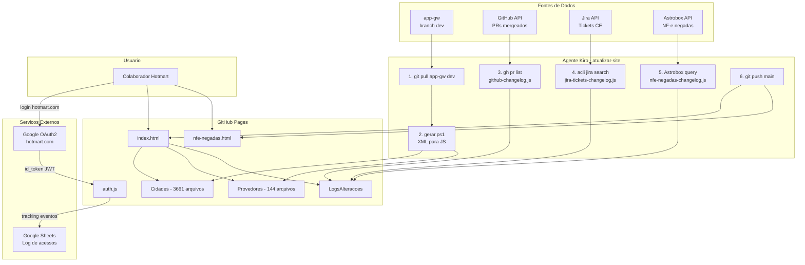
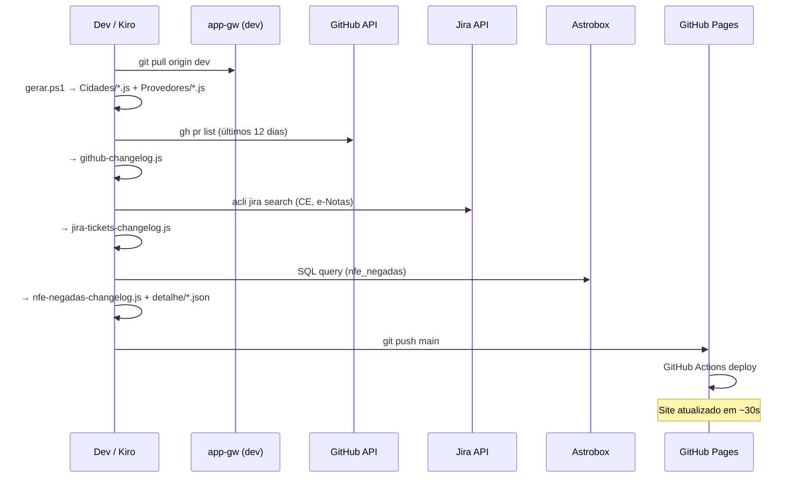

# 🏙️ Cidades & Provedores — eNotas Gateway

Base de conhecimento do eNotas Gateway. Consulte configurações de municípios, provedores de NFS-e, tratamentos especiais e acompanhe as últimas atualizações do sistema.

**URL:** https://enriqueboni-enotas.github.io/cidades-provedores/

## Acesso

O site é protegido por autenticação Google OAuth2 restrita ao domínio `@hotmart.com`. Apenas colaboradores Hotmart conseguem acessar. A tela de login exibe as logos Hotmart e eNotas com o nome do projeto.

## O que você encontra aqui

- **Consulta de Cidades** — Busca por nome, UF ou código IBGE. Exibe provedor atual, configurações fiscais, tratamentos especiais, checklist de configuração e erros comuns.
- **Consulta de Provedores** — Busca por nome do provedor. Exibe municípios ativos, regras fiscais, mapeamento de regime tributário, histórico de PRs e observações para CX.
- **Changelog GitHub** — Últimas atualizações do app-gw (PRs mergeados nos últimos 12 dias).
- **Tickets Resolvidos (CE)** — Tickets do Jira resolvidos no período, agrupados por tema.
- **NF-e Negadas** — Top motivos de negação por dia, com drill-down por empresa.
- **Dashboard NF-e Negadas** — Análise cruzada com gráficos de evolução, UFs, cidades e motivos (`nfe-negadas.html`).

## Stack

- HTML/CSS/JS puro — sem framework, sem build, sem bundler
- GitHub Pages com deploy via GitHub Actions
- Dados gerados a partir do repositório `enotas-org/app-gw`
- Visual alinhado com [help.hotmart.com](https://help.hotmart.com/pt-br) — fonte Nunito Sans, accent laranja Hotmart (#F04E23), ícones SVG/dots (sem emojis na UI)
- Autenticação Google OAuth2 (Implicit Flow) restrita a `@hotmart.com`
- Log de acessos via Google Sheets (Apps Script)

## Estrutura

```
├── index.html                  # Página principal — busca + changelog
├── nfe-negadas.html            # Dashboard NF-e negadas (gráficos)
├── auth.js                     # Autenticação Google OAuth2 + log de acessos
├── hotmart-logo.svg            # Logo Hotmart (chama + texto)
├── enotas-logo.png             # Logo eNotas
├── Cidades/                    # Dados de cidades (gerados)
│   ├── _index.js               # Índice com nome, UF, IBGE, provedor
│   └── {slug}.js               # Detalhe de cada cidade
├── Provedores/                 # Dados de provedores (gerados)
│   ├── _index.js               # Índice com nome, empresa, versões
│   └── {slug}.js               # Detalhe de cada provedor
├── LogsAlteracoes/             # Changelogs (gerados)
│   ├── github-changelog.js     # PRs mergeados (últimos 12 dias)
│   ├── jira-tickets-changelog.js # Tickets CE resolvidos
│   ├── nfe-negadas-changelog.js  # Top motivos de negação por dia
│   ├── em-andamento-changelog.js # Tickets em andamento
│   └── nfe-negadas-detalhe/    # Detalhe por empresa (JSON por dia)
├── .github/workflows/
│   └── pages.yml               # Deploy automático GitHub Pages
├── .kiro/
│   ├── agents/atualizar-site.md  # Agente de atualização automática
│   └── steering/project-standards.md # Padrões visuais e técnicos
└── gerar.ps1                   # Script PowerShell de geração de dados
```

## Arquitetura



### Fluxo de atualização



## Como atualizar os dados

Use o agente Kiro `atualizar-site` que executa automaticamente:

1. Atualiza o app-gw local (branch dev)
2. Regenera arquivos de Cidades e Provedores
3. Atualiza changelog GitHub (últimos 12 dias)
4. Atualiza tickets Jira resolvidos (projeto CE, produto e-Notas)
5. Atualiza NF-e negadas via Astrobox (requer token SSO Hotmart)
6. Commit e push

Os arquivos em `Cidades/`, `Provedores/` e `LogsAlteracoes/` são gerados automaticamente. **Não edite manualmente.**

## Padrões visuais

O arquivo `.kiro/steering/project-standards.md` documenta todos os padrões obrigatórios:

- Cores: accent laranja #F04E23, fundo claro #F5F5F0, sem azul na UI
- Fonte: Nunito Sans (Google Fonts)
- Ícones: SVG inline ou dots coloridos (●) — sem emojis na UI
- Dark mode: toggle na topbar, persistido no localStorage
- Topbar: logos Hotmart + eNotas + título + stats + user bar

## Segurança

- O site é público (GitHub Pages) mas protegido por autenticação Google OAuth2
- **Nunca** incluir razão social, CNPJ, nomes de clientes ou qualquer PII
- Apenas IDs (UUIDs) são permitidos para identificar empresas
- Autenticação é client-side (controle de acesso básico, não segurança real)

## Deploy

Push para `main` dispara o deploy automático via GitHub Actions (`pages.yml`). Propagação leva ~30 segundos.

## Log de acessos

Cada login e interação é registrado em uma Google Sheet via Apps Script:
- Ações rastreadas: `login`, `page_view`, `search`, `view_cidade`, `view_provedor`, `select_mode`, `view_tab`
- Timestamp em horário de Brasília (UTC-3)
- Para adicionar novo tracking: `if (window._authLogEvent) window._authLogEvent('acao', 'detalhe');`
